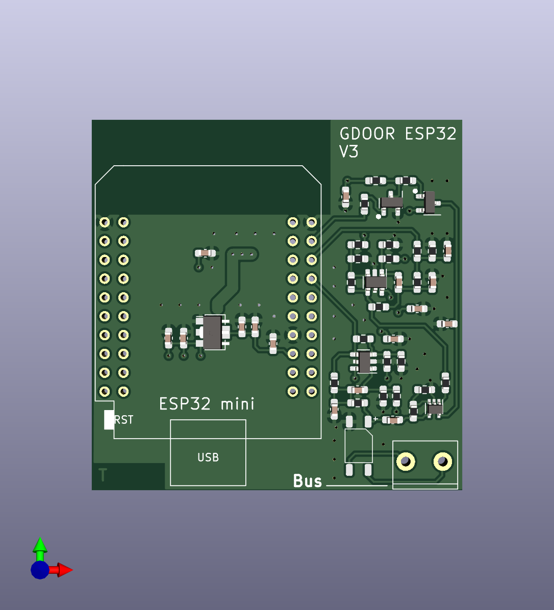
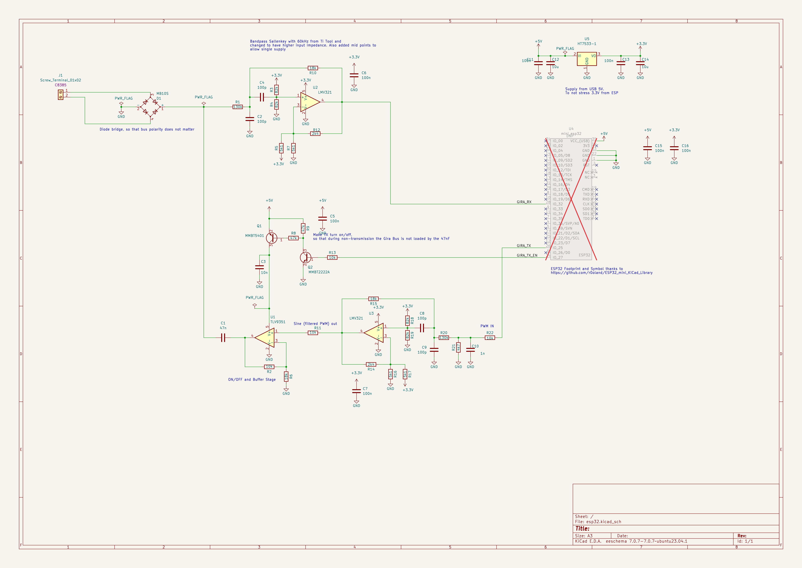

_________________

Gira is a german manufacturer of house appliances, including door systems.
These systems are connected via a proprietary two wire bus system.
GDOOR is a project to collect and document findings about the Gira Door System, all figured out by reverse engineering.

The Gdoor hardware adapter allows listening and controlling the bus and e.g. integrating a Gira door bell into a smart home. It might serve as an DIY alternative to the Gira TKS-IP-Gateway. It supports the following features:

- listening to the bus, e.g. to trigger notifications on mobile devices when a door bell button is pressed
- sending to the bus, e.g. to open the door

Receiving and sending audio/video is currently neither supported nor plannend.

Contributions are welcome!

# Bus Adapter Hardware
 

Currently work is ongoing to release a ESP32-based adapter, which translates the bus messages to MQTT/serial and vice versa.

Hardware can be found in the `hardware` subfolder,
corresponding firmware in the `firmware` subfolder.

> [!NOTE]  
> Work is not finished yet.

The adapter was successfully tested with
- Gira Türkommunikations-System Steuergerät Audio (1287 00)
- Gira Türkommunikations-System Steuergerät Video (1288 00)
- Gira Wohnungsstation AP (1250 015)
- Gira Wohnungsstation Video AP Plus (1239 03)
- Gira Türstation AP 1-fach (1266 65/66/67)
- Gira Türstation AP 3-fach (1267 65/66/67)

# Integrations with Smart Home Platforms

- [Home Assistant](/doc/integrations/home-assistant.md)

# Gira Bus Protocol

See [detailed findings about the Gira bus protocol](/doc/gira-bus.md).